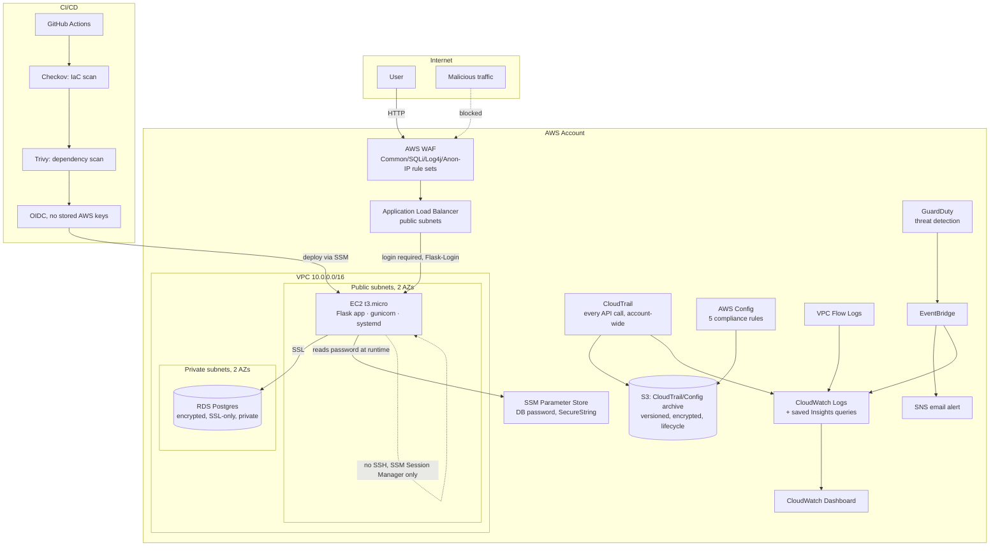

# SecureStack

A secure, monitored inventory management system, deployed on AWS with everything defined as code: infrastructure, security controls, and deployment pipeline included.

**Live app:** http://securestack-alb-469945048.us-east-1.elb.amazonaws.com

---

## The problem this is based on

At the City of Richmond, I built an inventory tracking system for supply management on SharePoint. The system itself had no infrastructure as code (everything was configured by hand through the SharePoint UI), no security scanning built into how changes were made, and no monitoring or alerting specific to it. It worked because I was the one keeping an eye on it, not because it was built to hold up without me.

SecureStack rebuilds that same idea (tracking items, quantities, locations) as a production-style cloud deployment instead. Infrastructure is provisioned by code instead of clicked together by hand, every change is scanned for security issues before it ships, and a monitoring layer actually tells you if someone is doing something they shouldn't. It's the difference between a system that works because someone happens to be watching it, and one built to hold up when no one is.

## Architecture



**Two-tier network.** The app server sits in public subnets (behind the ALB/WAF) so it's internet-reachable only through inspected traffic; the database sits in private subnets with no route to the internet at all. The database security group only accepts connections from the app's security group. Nothing else can reach it, not even other resources in the same VPC.

**No SSH, anywhere.** Every shell session, whether for setup, debugging, or deployments, goes through AWS Systems Manager Session Manager. There's no open port 22, no SSH key to lose or leak, and every session is logged by AWS itself.

**No long-lived credentials.** The EC2 instance reads its database password from SSM Parameter Store at runtime using its IAM role. Nothing is hardcoded or stored in a `.env` file checked into git. GitHub Actions authenticates to AWS via OIDC federation, requesting short-lived credentials scoped to one narrow IAM role for the duration of a single deploy. No AWS access keys exist anywhere in GitHub.

**Authentication.** Every page in the app requires a login (Flask-Login), except the `/health` endpoint the load balancer needs to stay unauthenticated to run its health checks. The one admin account's password is randomly generated by Terraform and stored encrypted in SSM Parameter Store, using the same trust model as the database password: never written to disk or committed. Login was originally attempted at the load balancer with AWS Cognito, which turned out to be a genuinely useful dead end. Cognito refuses to redirect a login to a plain-HTTP address, since doing so would send the session over an unencrypted connection. That's the correct behavior on Cognito's part, and it's the same reason this app doesn't have HTTPS yet: no owned domain to issue a certificate for. See `SECURITY_EXCEPTIONS.md` for the full writeup, including CSRF protection, security headers, and input validation added during the same review.

## Detection & monitoring

Rather than paying for a full SIEM (Wazuh's recommended sizing needs ~4GB RAM, well outside free tier), this project builds the same core capability (collect, alert, investigate) from native AWS services:

- **CloudTrail** logs every API call made in the account, shipped to both S3 (tamper-evident, versioned archive) and CloudWatch Logs (searchable).
- **GuardDuty** continuously analyzes that activity plus network/DNS traffic for signs of compromise.
- **EventBridge** routes every GuardDuty finding to two places at once: an email alert (SNS) and a searchable log group, so a finding isn't just sitting in a console waiting to be noticed.
- **Four saved CloudWatch Logs Insights queries** act as the "triage screen": failed database logins, rejected network traffic, IAM/root activity, and GuardDuty findings, the same starting point a SOC analyst would reach for.
- **A CloudWatch dashboard** ties all four views into one screen.
- **AWS Config** continuously checks five rules (encrypted volumes, no open SSH, no public S3, encrypted RDS storage, no admin-wildcard IAM policies) and flags drift automatically.

See [`IR-RUNBOOK.md`](IR-RUNBOOK.md) for the actual response process this feeds into.

## CI/CD pipeline

Every push to `main` runs through GitHub Actions:

1. **Checkov** scans every Terraform file for misconfigurations before anything is allowed to deploy. This is "shifting security left": catching a problem in code review instead of after it's already live.
2. **Trivy** scans the app's Python dependencies for known CVEs.
3. If both pass, the pipeline authenticates to AWS via OIDC (no stored keys) and tells the app server to pull the latest code and restart, over SSM, the same no-SSH approach used everywhere else.

A failing scan blocks deployment. There is no path to production that skips the scan.

## Security tradeoffs (and why they're not oversights)

Every Checkov finding this project doesn't fix is documented, with reasoning, in [`SECURITY_EXCEPTIONS.md`](SECURITY_EXCEPTIONS.md). It's split into genuine cost tradeoffs (e.g. a customer-managed KMS key costs ~$1/month per key and wasn't judged worth it at this scale), intentional design decisions (e.g. the app is a public website by design, so port 80 open to the world is the point, not a mistake), and things that were fixed outright. The goal wasn't a perfect scan. It was a defensible one, where every accepted risk has a stated reason instead of a silent skip.

## Cost management

Everything here runs inside AWS free tier except AWS WAF (~$8-10/month, no free tier, since there's no way to inspect ALB traffic for free) and standard data-transfer/request charges at trivial volume. WAF is deployed and left running under a self-imposed ~$10 budget for demo purposes, with a documented one-command teardown in [`DEMO.md`](DEMO.md) once it's no longer needed. Everything else (VPC, EC2, RDS, CloudTrail, GuardDuty, Config, the ALB itself) has no ongoing cost at this scale.

## What I'd do differently at production scale

- **HTTPS end-to-end, and Cognito once it's there.** The ALB currently serves plain HTTP because an ACM certificate requires a domain you own, and this project doesn't have one. A real deployment would own a domain, issue a free ACM cert, redirect all HTTP to HTTPS, and move authentication back up to the load balancer with Cognito, the pattern this project originally tried and the correct one once there's a domain to support it.
- **Multi-AZ RDS** for actual failover, not just multi-AZ subnets. Skipped here because it roughly doubles database cost for a single-user demo with no uptime requirement.
- **Customer-managed KMS keys** instead of AWS-managed defaults, for full control over key rotation and access. A small recurring cost that becomes worth it once there's real data or compliance scope involved.
- **A real SIEM** (Wazuh, or a managed alternative) once traffic and headcount justify the ~$30-60/month for properly-sized infrastructure and someone to actually staff triage.
- **Auto Scaling** instead of a single EC2 instance, plus health-check-based replacement.

## Tech stack

Terraform, AWS (VPC, EC2, RDS, ALB, WAFv2, IAM/OIDC, CloudTrail, GuardDuty, Config, EventBridge, SNS, CloudWatch, SSM, S3), Python/Flask, SQLAlchemy, Gunicorn, GitHub Actions, Checkov, Trivy

## Repo structure

```
terraform/     - all infrastructure as code
app/           - Flask inventory app
deploy/        - EC2 bootstrap script + systemd service
.github/       - CI/CD pipeline (security-scan + deploy)
SECURITY_EXCEPTIONS.md - every accepted Checkov finding, with reasoning
IR-RUNBOOK.md  - incident response process for this environment
DEMO.md        - cost-controlled WAF teardown process
```
